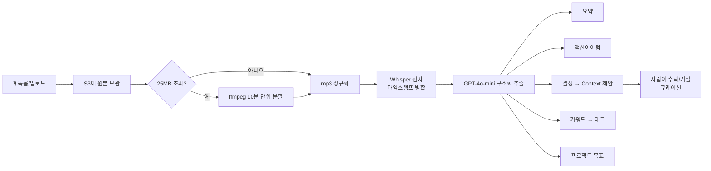
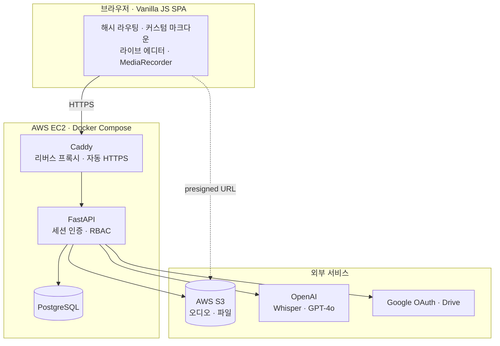

<div align="center">

# 🧶 Weave

**회의를 녹음하면 AI가 요약·할 일·결정을 정리하고, 프로젝트 히스토리로 엮어주는 협업 워크스페이스**

녹음 · 전사 · 요약 · 액션아이템 · 결정 큐레이션 · 문서 연결까지 — 흩어진 회의를 프로젝트 하나로 꿰맵니다.

<br>


### **[▶ 라이브 데모](https://weaveapp.duckdns.org)** · **[GitHub](https://github.com/leahseule/weave)**

</div>

---

## 💡 왜 만들었나

회의는 매일 쌓이지만, 정작 **"그때 뭘 결정했더라?"** 는 흩어진 녹음·메모·문서 사이에서 매번 다시 찾아야 합니다.
Weave는 회의를 **프로젝트 단위 히스토리**로 모으고, **녹음만 하면 AI가 요약·할 일·결정을 자동으로 정리**해
"다시 찾는 시간"을 없애는 것을 목표로 만든 풀스택 웹앱입니다.

> 기획자 출신으로서 **"문제 정의 → 제품 설계 → 직접 구현 → 배포"** 전 과정을 혼자 관통해보려고 만든 개인 프로젝트입니다.

<br>

## 🖥 데모

> 📸 스크린샷을 `docs/` 폴더에 넣고 아래 주석을 풀어주세요.

<!--
| 홈 (프로젝트 목록) | 회의 상세 (전사 + AI 요약) |
|:---:|:---:|
|  |  |

| 녹음 → 실시간 메모 | 캘린더 (마감 액션아이템) |
|:---:|:---:|
|  |  |
-->

<br>

## ✨ 핵심 기능

### 🎙 회의 녹음 → AI 자동 정리
- 브라우저에서 바로 녹음(일시정지/재개, 실시간 파형·메모) 또는 음성 파일 업로드
- **OpenAI Whisper** 전사 — 긴 녹음(25MB↑)은 ffmpeg로 10분 단위 분할 전사 후 타임스탬프 병합
- **GPT-4o-mini** 가 전사문에서 **요약 · 액션아이템 · 결정 · 키워드 · 프로젝트 목표**를 한 번에 추출

### 🛟 녹음 안전망 (유실 방지)
- 녹음 오디오를 전사 **전에 S3에 먼저 보관** → 전사가 실패/중단돼도 원본은 안전
- 전사 실패해도 회의는 생성되고, 상세 화면의 **"다시 전사"** 버튼으로 언제든 복구

### 🧑‍🤝‍🧑 프로젝트 협업 (RBAC)
- 이메일 초대 + **소유자 / 편집자 / 뷰어** 3단계 권한
- 모든 쓰기 동작이 서버에서 권한 게이팅

### 📝 옵시디언식 라이브 마크다운 에디터
- 엔터를 칠 때마다 그 줄이 바로 렌더링되는 인라인 편집기 (별도 미리보기 창 없음)
- 메모를 저장하면 AI가 제목·요약·할 일을 자동 정리

### 🔗 통합 & 관리
- **Google Drive** 연결 — 회의 관련 문서 검색·핀
- **Obsidian** 볼트 연결 — 로컬 노트를 메모로 가져오기
- **S3 파일 업로드** — presigned URL로 브라우저가 S3와 직접 업/다운로드 (서버 미경유)
- **캘린더** — 마감일 지정된 액션아이템을 한눈에
- 링크 추가 시 페이지 제목 자동 수집 (SSRF 방어 포함)

<br>

## 🧠 작동 방식 — AI 파이프라인



AI가 뽑은 **결정·목표·태그는 곧바로 확정되지 않고** "제안(proposed)" 상태로 들어가,
사용자가 수락해야 프로젝트 Context에 반영됩니다 (**AI 제안 → 사람 큐레이션**).

<br>

## 🏗 아키텍처



- **프론트엔드는 프레임워크 없이** 바닐라 JS로 구현 — 해시 라우팅, 커스텀 마크다운 파서/에디터, 녹음까지 직접 작성
- FastAPI가 API와 정적 프론트를 함께 서빙, Caddy가 앞단에서 자동 HTTPS 처리
- 파일은 서버를 거치지 않고 **presigned URL로 브라우저 ↔ S3 직접 전송**

<br>

## 🛠 기술 스택

| 영역 | 사용 기술 |
|------|-----------|
| **Frontend** | Vanilla JS (SPA · 무프레임워크), 커스텀 Markdown 렌더러·라이브 에디터, 반응형 CSS, Web Audio · MediaRecorder |
| **Backend** | FastAPI, SQLAlchemy 2.0, Alembic, Pydantic, 세션 인증(bcrypt) |
| **Data** | PostgreSQL, AWS S3 (boto3) |
| **AI** | OpenAI Whisper (STT), GPT-4o-mini (구조화 추출), ffmpeg (오디오 정규화·분할) |
| **통합** | Google OAuth (OpenID Connect) · Drive API, Obsidian 볼트 |
| **Infra** | Docker · docker-compose, Caddy (자동 HTTPS), AWS EC2, DuckDNS |

<br>

## 🔍 엔지니어링 하이라이트

혼자 부딪히며 해결한 것들 — *"왜 안 되는지"* 를 끝까지 파고든 기록:

- **녹음 유실 근본 차단** — 오디오를 전사 전 S3에 선(先)보관하고, 전사 실패 시에도 회의를 생성해 "다시 전사"로 복구. (실제로 중요한 회의를 잃은 뒤 설계한 안전망)
- **webm 전사가 중간에 끊기는 문제** — 브라우저 MediaRecorder의 webm은 duration 헤더가 없어 Whisper가 도중에 멈춤. 전사 전 ffmpeg로 mp3 정규화해 전체를 온전히 전사.
- **S3 CORS "Failed to fetch" 디버깅** — presigned URL이 글로벌 엔드포인트로 서명돼 리전 불일치 301 리다이렉트 → CORS 차단. 리전 엔드포인트를 명시해 해결.
- **옵시디언식 라이브 에디터** — contenteditable을 줄 단위 블록으로 관리, 렌더된 줄은 `contenteditable=false`로 잠가 원본(마크다운) 유실 방지.
- **긴 오디오 청크 전사** — 25MB 상한을 ffmpeg 분할 + 타임스탬프 오프셋 병합으로 우회.
- **SSRF 방어** — 링크 제목 자동 수집 시 사설·루프백·링크로컬 IP를 차단.
- **AI 제안 → 사람 큐레이션** — LLM 산출물을 곧바로 신뢰하지 않고 proposed 상태로 두는 휴먼-인-더-루프 설계.

<br>

## 🚀 로컬 실행

```bash
git clone https://github.com/leahseule/weave.git
cd weave
cp .env.example .env      # OPENAI_API_KEY 등 값 채우기 (선택)
docker compose up --build
```

- 앱: http://localhost:8000
- API 문서(Swagger): http://localhost:8000/docs
- 헬스체크: http://localhost:8000/health → `{"status":"ok","db":true}`

> `OPENAI_API_KEY`, Google OAuth, AWS(S3) 값은 모두 **선택**입니다.
> 없으면 해당 기능(전사·Drive·파일 업로드)만 비활성되고 나머지는 정상 동작합니다.

**DB 마이그레이션(Alembic)** 은 컨테이너 기동 시 `alembic upgrade head`로 자동 적용됩니다.

<br>

## ☁️ 배포

Docker Compose로 **AWS EC2**에 배포하며, Caddy가 도메인에 대해 Let's Encrypt HTTPS를 자동 발급합니다.

```bash
# 서버에서
cd ~/weave && git pull
docker compose -f docker-compose.prod.yml up -d --build
```

자세한 단계는 [`EC2_DEPLOY.md`](EC2_DEPLOY.md) · [`DEPLOY.md`](DEPLOY.md) 참고.

<br>

## 📁 프로젝트 구조

```
weave/
├── docker-compose.yml          # 개발용 (api + db)
├── docker-compose.prod.yml     # 운영용 (+ Caddy 자동 HTTPS)
├── Caddyfile
└── backend/
    ├── Dockerfile              # ffmpeg 포함
    ├── requirements.txt
    ├── alembic/                # DB 마이그레이션
    ├── app/
    │   ├── main.py             # FastAPI 앱 · 세션 · 프론트 서빙
    │   ├── models.py           # SQLAlchemy 모델
    │   ├── schemas.py          # Pydantic 스키마
    │   ├── auth.py             # 인증 · RBAC 게이팅
    │   ├── routers/            # projects · sources · meetings · files · drive · obsidian · calendar · curation · auth
    │   └── services/           # transcription(Whisper) · extraction(GPT) · storage(S3) · drive · obsidian · oauth_login · link_title
    └── frontend/               # 바닐라 SPA (index.html · app.js · styles.css)
```

<br>

---

<div align="center">

**Weave** — 흩어진 회의를 프로젝트 하나로 엮다.

<sub>개인 풀스택 프로젝트 · FastAPI · PostgreSQL · OpenAI · AWS</sub>

</div>
